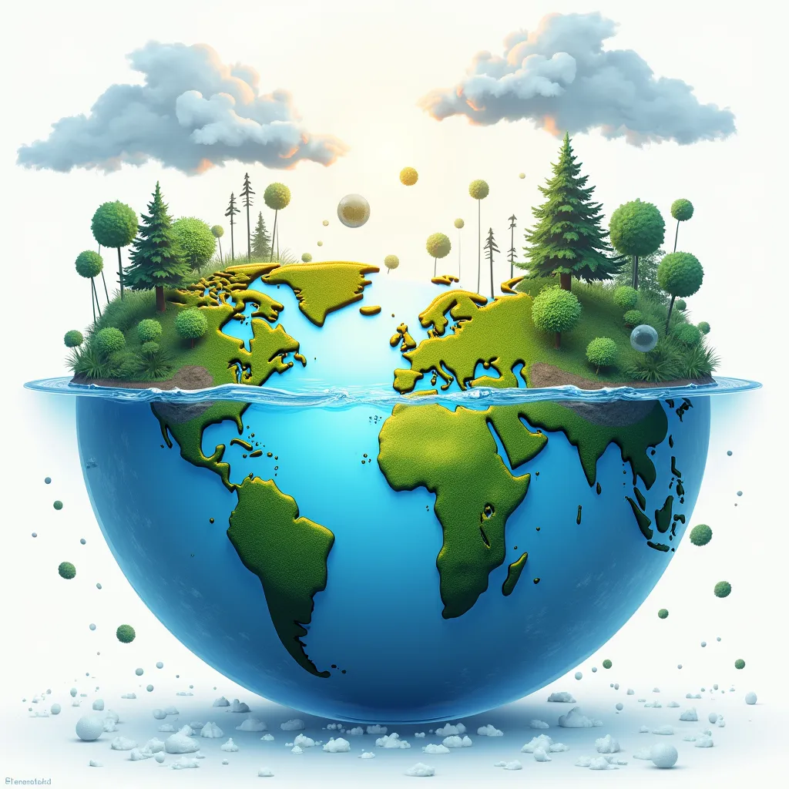

# Welcome to my website

---

### Hello! I am Dhanudhara

I'm a software engineer, developer, sustainability enthusiast, and a director. This is my personal website, where I share all my latest projects, ideas, blog, and how you can get in touch.

    <figure>
        
        <figcaption>This banner was created by AI!</figcaption>
    </figure>

### Call to action

---

    

        <a href="{{ '/projects' }}">My projects</a>
    

    

        <a href="{{ '/posts' }}">My blogs</a>
    

    

        <a href="{{ '/about' }}">Learn more about me</a>
    

    

        <a href="{{ '/contact' }}">Get in touch</a>
    

